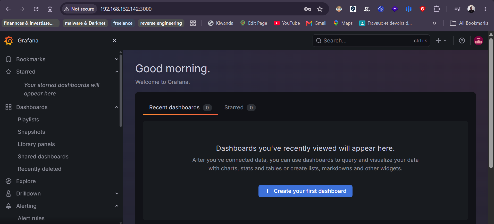
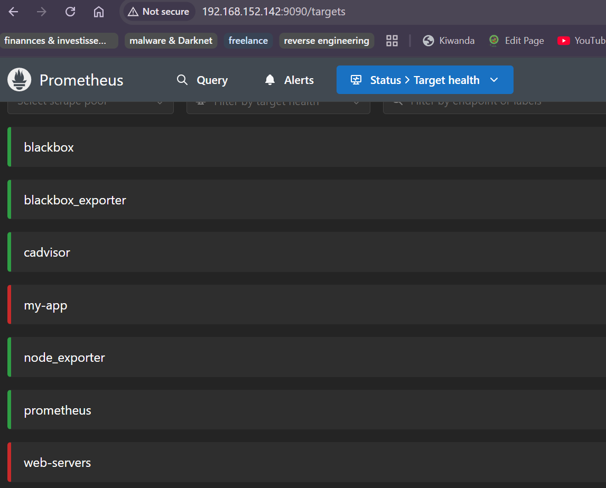

# GRAFANA & PROMETHEUS POUR LE MONITORING 

**Objectif :** Ce projet a pour but de mettre sur pied un serveur de monitoring  afin de contrôler nos ressources (applications, serveur(windows ou linux), container, etc). Cette surveillance nous permettra d'être facilement alerté en cas de problème et de réagir rapidement pour y remédier. 


### I- PERIMETRE 
Ce projet ce structure en deux une partie de collecte avec prometheus et une autre avec Grafana pour une collecte de logs et une visuation via des dashbord des données collectées pour l'ensemble de l'ensemble collecté. Pour ce lab nous sommes limités à un seul un serveur qui jouera à la fois le rôle de serveur de monitoring et de serveur d'application. Bien que dans la pratique (production), nous pouvons avoir des serveurs d'applications des serveurs de monitoring (SOC ou NOC). Il ne s'agit pas de monitroing __d'équipements réseau__ (switch, routeur, parefeu, etc). 

<p align="center">
  
  
</p>


### II- PREREQUIS
Bien que ce readme a pour but de donner des indications sur comment le reproduire, ainsi que les commentaires dans les fichiers yaml (.yml) qui vise à faciliter la compréhension. Il est important que vous ayez des notions en **containeurisation, orchestration de container, langage yml, les notions autours du monitoring (métriques, différentes formes de réprésentation, etc..)**. Il faut aussi avoir installé et configuré sur une **VM/VPS/VDS** Linux le necessaire suivant :
- Docker et Docker compose ;
- Python version 3 et pip version 3 ;
- prometheus-client 


### III- PROMETHEUS

**NB : Exécuter les commandes suivantes en étant dans le repertoire prometheus**

Pour mettre en marche notre outil prometheus,  :
1) Modifier l'adresse IP définit dans nos fichiers de configuration et remplacer par l'IP de votre server.

2) Démarrage de prometheus et de ses exporteurs 
```powershell
# Passer en mode superutilisateur
- sudo -s

# Installation et démarrage de prometheus et du nécessaire (exporteurs)
- docker compose up -d

# Vérifier que les conteneurs (prometheus, node exporter, blackbox exporter, etc) ont bien démarré
- docker container ls 

# Pour recreer nos conteneurs si vous vous êtes trompés dans l'ordre d'exécution
docker compose up -d --force-recreate
```
3) Exécutons l'application 1 (On peut aussi exécuter l'étape 4 si nous utiliser le container à la place)

```powershell
# Installation de prometheus-client si ce n'est pas encore faire 
pip install prometheus-client

# Démarrage en arrière plan de l'application 1 
nohup python3 ./application_1/resume_metric.py > app.log 2>&1 &
```

4) Executons l'application via Docker (au lieu de faire l'étape 3)

```powershell
# Dans le repository 
# construire l'image de l'application.  
docker build -t prometheus/custom_app .

# Vérifions les nouvelles images (prometheus/custom_app et tiangolo/uwsgi-nginx-flask) présentes sur notre machine 
docker images

# Place à l'exécution/lancement de notre application
docker run -d -p 5001:5001 prometheus/custom_app:latest
```

6) Accéder à l'interface graphique de vos outils :
    - Pour prometheus : http://votre_ipv4:9090
    - Pour node exporter : http://votre_ipv4:9100
    - Pour blackbox exporter : http://votre_ipv4:9115
    - Pour alert manager : http://votre_ipv4:9093
    - Pour l'application 1 :http://votre_ipv4:5000

**NB :** Il faudra exécuter les commandes ci-dessus dans le terminal en étant dans le repertoire prometheus.
